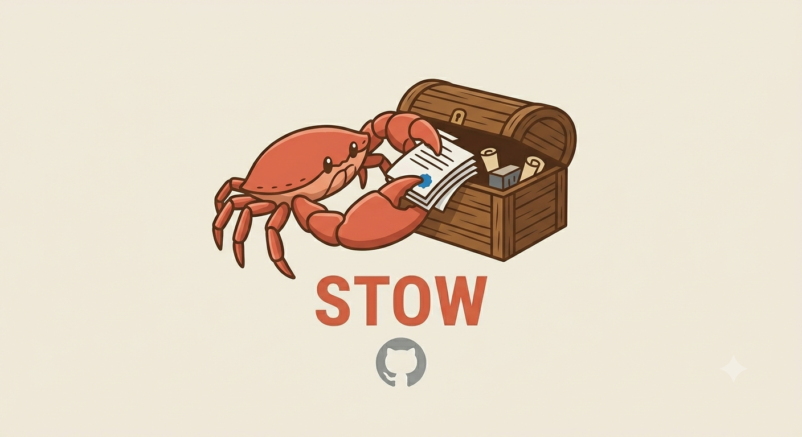

<p align="center"></p>

A small local MCP server for Claude Code: store large text you don't need to read in full right now, search it later.

## Why

Some tool output is too large for any compression ratio to help — a big log dump, a fully-fetched web page, a huge one-off API response. [RTK](https://github.com/rtk-ai/rtk) and [sqz](https://github.com/ojuschugh1/sqz) both compress output before it reaches the model, and do that well, but there's no ratio that makes a 500KB log file fit comfortably in context. stow doesn't compress — it stores the full content locally in SQLite (FTS5, BM25 ranking) and gives the model a short reference plus a `search` tool to pull back only the relevant part later.

Built after trialing [context-mode](https://github.com/mksglu/context-mode), which does something similar but bundles it with default-on telemetry, a fabricated-looking "learned about you" stat (actually just re-displaying Claude Code's own pre-existing native memory files under a different name), and a paid "Insight" dashboard that shows productivity claims about a session it never received any data from. The sandboxed-storage idea is sound; the rest of it isn't something to run. This is the idea alone, nothing else.

## What it does

Three MCP tools:

- **`capture(content, source, tool)`** — store text. Under 2KB, returns it unchanged (no point storing something already small). Over 2KB, stores it and returns a short reference stub with an ID.
- **`search(query, limit?)`** — BM25 full-text search (SQLite FTS5) across everything ever captured. Returns snippets with IDs.
- **`show(id)`** — the exact original content for a given ID, byte-for-byte.

Plus a one-time `SessionStart` hook that tells the model these tools exist and when to reach for them. That's the only hook — no `PreToolUse` interception, nothing redirects or blocks another tool call. If a session doesn't use `capture`, nothing happens; it's opt-in every time, not a silent proxy sitting in front of everything.

## What it deliberately doesn't do

- No telemetry, no network calls, no cloud sync. Everything lives in `~/.stow/store.db`.
- No dashboard, no "productivity insight," no upsell.
- Doesn't replace RTK or sqz — those still own shell-output compression and the `github` MCP proxy respectively. This fills the gap they leave: things too large to usefully compress at all.

## Install

```bash
cargo build --release
cp target/release/stow ~/.local/bin/stow
```

Register as an MCP server (`~/.claude/settings.json` or a project's `.mcp.json`):

```json
{
  "mcpServers": {
    "stow": { "command": "/home/YOUR_USER/.local/bin/stow", "args": ["mcp"] }
  }
}
```

Optionally wire the SessionStart hint (`~/.claude/settings.json`, under `hooks.SessionStart`):

```json
{
  "hooks": {
    "type": "command",
    "command": "/home/YOUR_USER/.local/bin/stow hook sessionstart"
  }
}
```

## CLI (for manual use / piping)

```bash
stow search "some query"
stow show 42
echo "some large blob" | stow store --source "my-command" --tool "bash"
```

## Tech

Rust, `rusqlite` with the `bundled` feature (SQLite compiled from source with FTS5 built in — no system SQLite dependency, no separate FTS5 flag needed). Single static binary, same reasoning as [clawband](https://github.com/jamessoubry/clawband): fast startup on every call, no runtime dependency chain.
